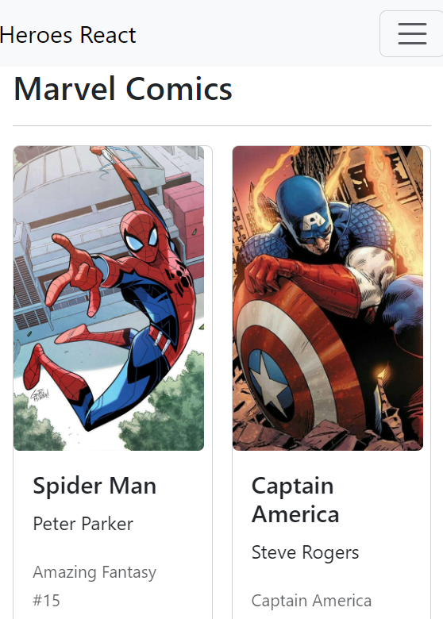
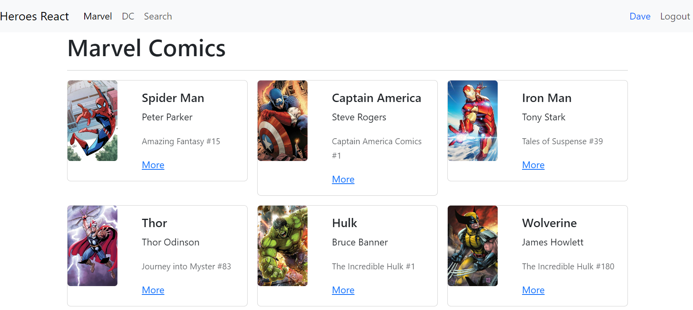

# Heroes of Marvel & DC React Application
Single Page Application about heroes of Marvel and DC.

## Table of Contents <a name="table_contents"/> 
- [Live Demo](#live_demo)  
- [Concepts Applied](#concepts_applied)
- [Folder Structure](#folder_structure)
- [Future Development](#future_dev)
- [Credits](#credits)
- [Author](#author)

## Live Demo <a name="live_demo"/>
[Click Me!](https://heroes-react-dtc.netlify.app/)

- ### Mobile View
 
- ### Desktop View
 

## Concepts applied <a name="concepts_applied"/>
- [x] Custom Hooks.
- [x] Routing.
- [x] Local Authentication.
- [x] UseContext.
- [x] Responsiveness.
- [x] Components in React.

## Folder Structure <a name="folder_structure"/>
    .   ├── heroes-react
                ├── Assets                         # Images
                    ├── img                        # ReadMe Imgs
                ├── node_modules                   # NodeJS Modules
                ├── public                         # Vite Public Files
                    ├── heroes                     # Hero Images
                ├── src                            # src Folder
                    ├── auth                       # Everything related to authentication
                    ├── heroes                     # Hero data/components/hooks/etc   
                    ├── hooks                      # useForm for the search page
                    ├── router                     # Private/Public routes
                    ├── ui                         # NavBar Component
                    ├── HeroesApp                  # Children Route from Main.jsx
                    ├── Main                       # Father Route

## Future Development <a name="future_dev"/>
- [ ] Add a Backend. 
- [ ] Add more hero images and information.
- [ ] Add an author section that links to my portfolio.
- [ ] Add a authentication system through the login.

## Credits <a name="credits"/>
Kudos to Fernando Herrera for his amazing react course in Udemy.

## Author <a name="author"/>
David Torres [**LinkedIn**](https://www.linkedin.com/in/david-tc/)

### [Go to table of contents](#table_contents)
